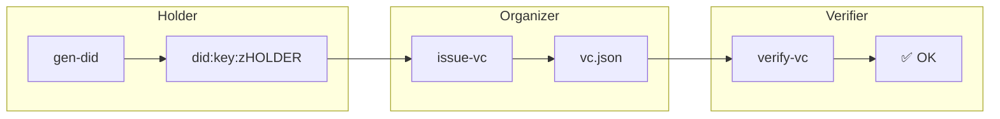

# DID-Based Guestbook

A minimal CLI tool demonstrating decentralized identity with DIDs and Verifiable Credentials (VCs).
It allows:

1. **Holder**: Generate a DID (`did:key`) and (optionally) request a VC.
2. **Issuer (Organizer)**: Issue a VC to a specific DID.
3. **Verifier**: Verify that a given DID holds a valid VC.

---

## 1. Project Overview

* **DID Method**: `did:key` (no external registry; public key–derived).
* **Verifiable Credentials**: Issued by the Organizer to gate access.
* **Flow**:

  1. Holder runs `gen-did` → obtains `did:key:…`.
  2. Organizer runs `issue-vc` → outputs `vc.json` for that DID.
  3. Verifier runs `verify-vc` → checks proof on `vc.json` against the DID.

---

## 2. Commands & Usage

### 2.1 Generate a DID (`gen-did`)

```bash
guestbook gen-did --out holder-did.txt
```

* Generates an Ed25519 key pair.
* Derives `did:key:z…` from the public key.
* Saves private key in `~/.guestbook/keys/<did>/private.key`.
* Writes the DID URI to `holder-did.txt`.

### 2.2 Issue a Verifiable Credential (`issue-vc`)

```bash
guestbook issue-vc \
  --issuer-did did:key:zISSUER… \
  --subject-did did:key:zHOLDER… \
  --type GuestbookAccess \
  --out vc.json
```

* Organizer loads their private key (`~/.guestbook/keys/<issuer>/private.key`).
* Creates a VC JSON:

  ```json
  {
    "@context": ["https://www.w3.org/2018/credentials/v1"],
    "type": ["VerifiableCredential","GuestbookAccess"],
    "issuer": "did:key:zISSUER…",
    "issuanceDate": "<now>",
    "credentialSubject": { "id": "did:key:zHOLDER…" },
    "proof": { /* Ed25519Signature2018 over the VC */ }
  }
  ```

### 2.3 Verify a Verifiable Credential (`verify-vc`)

```bash
guestbook verify-vc \
  --vc vc.json
```

* Loads the VC file.
* Extracts `issuer` DID and resolves it (decodes public key).
* Verifies the `proof` signature over the VC JSON.
* Outputs success (`✅ valid VC for did:key:zHOLDER…`) or failure.

---

## 3. Architecture Diagram



---

## 4. Next Steps

* **Extend DID Methods**: switch to `did:ethr` with on-chain registry.
* **Attribute VCs**: include metadata in VC.
* **Storage**: archive VCs in IPFS or database.
* **UI**: add a simple web or TUI front-end for non‑CLI users.
